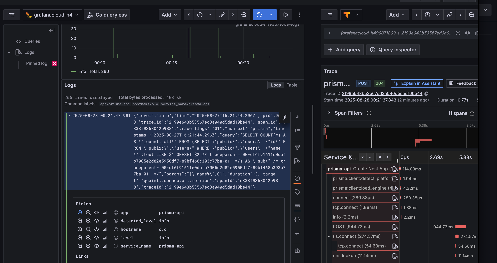
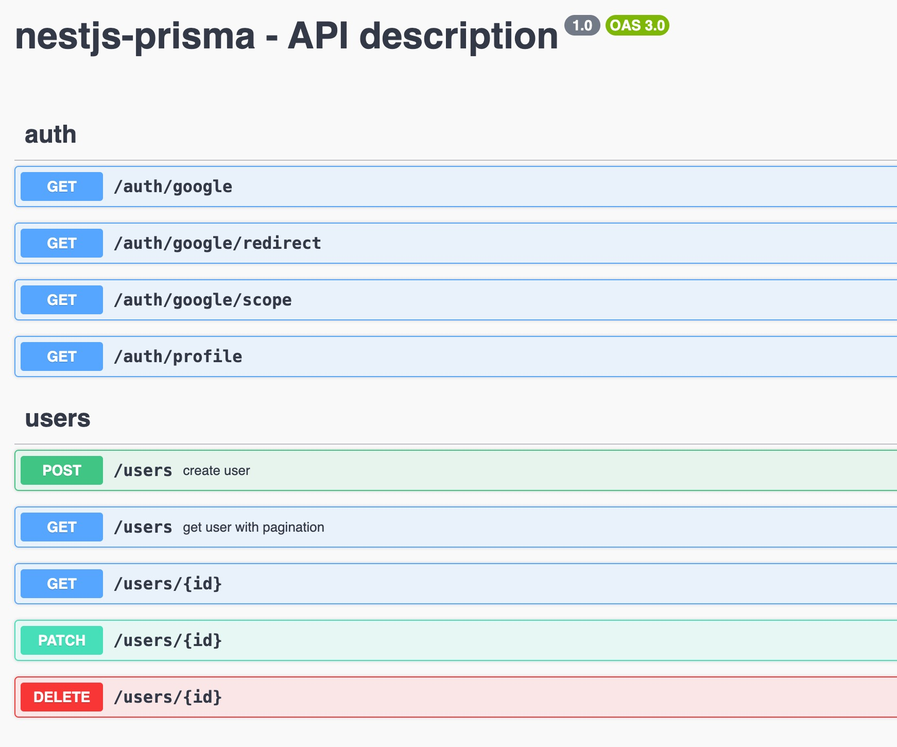
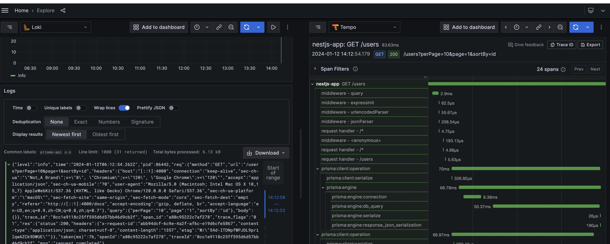
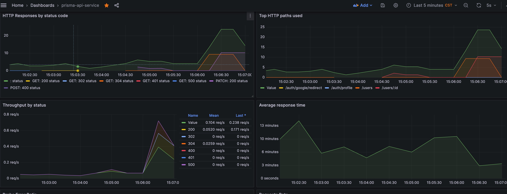
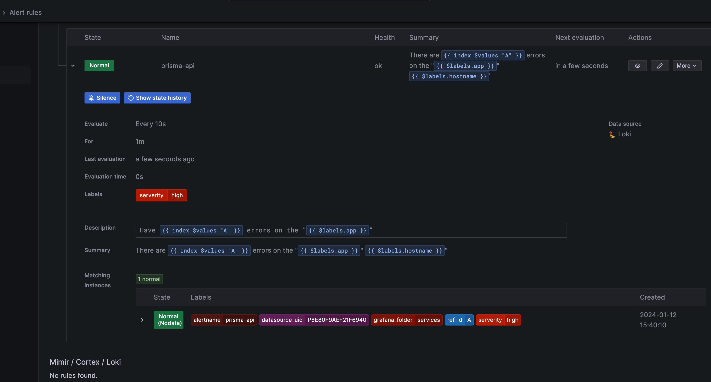
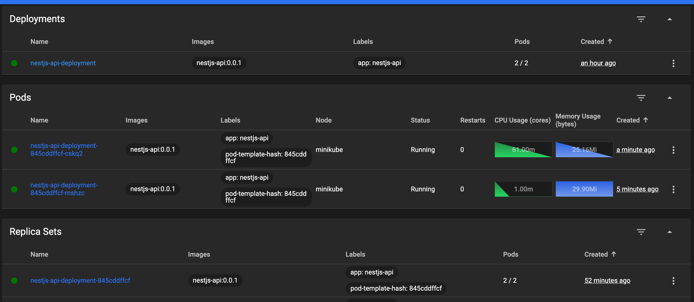
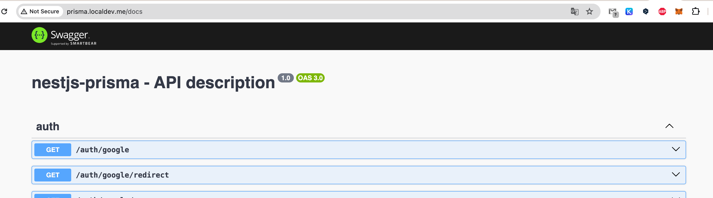

# NestJS Prisma API Template

A modern RESTful API template built with NestJS and Prisma, featuring comprehensive monitoring, logging, and deployment solutions.

## ✨ Features

### 🚀 Core Technology Stack

- **Framework**: [NestJS](https://nestjs.com/) + [Express](https://expressjs.com/)
- **Database**: [Prisma](https://prisma.io) ORM
- **Logging**: [Pino](https://github.com/pinojs/pino) + [nestjs-pino](https://github.com/iamolegga/nestjs-pino)
- **Caching**: [cache-manager](https://github.com/nestjs/cache-manager)

### 🔐 Authentication & Authorization

- **Auth Strategy**: [Passport](https://github.com/nestjs/passport)
  - JWT Authentication: [passport-jwt](https://www.passportjs.org/packages/passport-jwt/)
  - Google OAuth: [passport-google-oauth20](https://www.passportjs.org/packages/passport-google-oauth20/)

### 📊 Monitoring & Observability

- **API Documentation**: [Swagger](https://github.com/nestjs/swagger)
- **Distributed Tracing**: [OpenTelemetry](https://github.com/pragmaticivan/nestjs-otel)
- **Metrics**: [Prometheus](https://prometheus.io/)
- **Log Aggregation**: [Grafana Loki](https://grafana.com/docs/loki/latest/)
- **Alerting**: [Alertmanager](https://grafana.com/docs/grafana/latest/alerting/set-up/migrating-alerts/legacy-alerting/grafana-cloud-alerting/alertmanager/)

### 🐳 Deployment & Operations

- **Containerization**: Docker + Docker Compose
- **Orchestration**: Kubernetes configurations
- **Health Checks**: Built-in health check endpoints

## 🚀 Quick Start

### Environment Setup

1. **Clone the project**

```bash
git clone https://github.com/iamnivekx/nestjs-prisma-api
cd nestjs-prisma-api
```

2. **Install dependencies**

```bash
pnpm install
```

3. **Environment configuration**

```bash
cp .env.example .env
# Edit .env file to configure database connection and other settings
```

4. **Database initialization**

```bash
# Generate Prisma client
pnpm run prisma:generate

# Run database migrations
pnpm run prisma:migrate:dev
```

5. **Start development server**

```bash
pnpm run start:dev
```

The application will start at `http://127.0.0.1:4000`, with Swagger documentation available at `http://127.0.0.1:4000/docs`.

## ⚙️ Configuration Guide

### Grafana Cloud Configuration

#### 1. Configure Loki Log Collection

Visit [Grafana Cloud Logs]`https://grafana.com/orgs/{your-org-id}/hosted-logs/{your-dashboard-id}#sending-logs` to get configuration information.

Configure in your `.env` file:

```bash
LOG_LOKI_HOST="your-loki-url"
LOG_LOKI_USERNAME="your-username"
LOG_LOKI_PASSWORD="Basic <Your Grafana.com API Token>"
```

#### 2. Configure OpenTelemetry Tracing

Visit [Grafana Cloud OTLP]`https://grafana.com/orgs/{your-org-id}/stacks/{your-stack-id}/otlp-info` to get configuration information.

Configure in your `.env` file:

```bash
OTEL_EXPORTER_OTLP_PROTOCOL="http/protobuf"
OTEL_EXPORTER_OTLP_ENDPOINT="https://otlp-gateway-prod-ap-southeast-1.grafana.net/otlp"
OTEL_EXPORTER_OTLP_HEADERS="Authorization=Basic {your-api-key}"
```



### Grafana Docker Environment

Use [dockotlp](https://github.com/iamnivekx/dockotlp) to quickly set up a local monitoring environment:

```bash
git clone https://github.com/iamnivekx/dockotlp.git
cd dockotlp
docker compose up -d
```

## 🐳 Deployment

### Docker Deployment

1. **Build image**

```bash
docker-compose build
```

2. **Start services**

```bash
docker-compose up -d
```

### Production Deployment

1. **Install dependencies and build**

```bash
pnpm install
pnpm run build
```

2. **Start production service**

```bash
pnpm run start:prod
```

### Database Migrations

- **Development**: `pnpm run prisma:migrate:dev`
- **Production**: `pnpm run prisma:migrate:deploy`

## 📸 Feature Preview

### API Documentation (Swagger)



### OpenTelemetry Distributed Tracing



### Prometheus Metrics Monitoring



### Alert Management



### Kubernetes Deployment



### Ingress Configuration



## 📁 Project Structure

```
src/
├── api/                    # API modules
│   ├── auth/             # Authentication module
│   ├── health/           # Health checks
│   └── users/            # User management
├── common/                # Common modules
│   ├── constants/        # Constant definitions
│   ├── decorators/       # Custom decorators
│   └── guards/           # Guards
├── config/                # Configuration module
├── entities/              # Data entities
├── prisma/                # Prisma configuration
└── services/              # Business services
```

## 🤝 Contributing

Issues and Pull Requests are welcome!

## 📄 License

This project is licensed under the MIT License.

## 🙏 Acknowledgments

- [grafana](https://grafana.com) - Grafana
- [dockotlp](https://github.com/iamnivekx/dockotlp) - Docker OpenTelemetry Prometheus Loki Grafana environment
- [nestjs-prisma](https://github.com/notiz-dev/nestjs-prisma) - NestJS Prisma integration
- [nestjs-otel](https://github.com/pragmaticivan/nestjs-otel) - OpenTelemetry integration
- [nestjs-otel-prom-grafana-tempo](https://github.com/pragmaticivan/nestjs-otel-prom-grafana-tempo) - Monitoring stack integration examples
